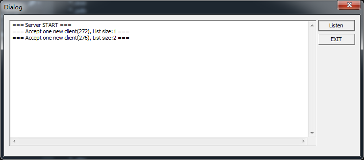

# Winsock pratice

## 目标

使用 winsock 实现 `HTTP Server`。

## 描述

绑定端口接受 browser 请求，开启新的 sock 网络连接 `ras(remote assess shell)` 服务器。

这个对话框程序既是 Server 也是 Client。

对于 Web browser 来说是 Server，对 `ras` 来说是 Client。

故 `winsock` 需要完成两个任务：

1. 解析 HTTP 请求（主要是 requestline，接受 GET method）
2. WSAAsyncSelect 网络连接到多个 `ras`

nonblocking 是通过 WASAsyncSelect 来完成。

## 测试

浏览器输入 `127.0.0.1:port`，窗口出现如下效果， prot define 在文件头部。 

