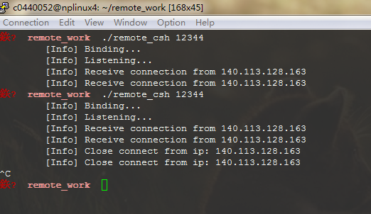
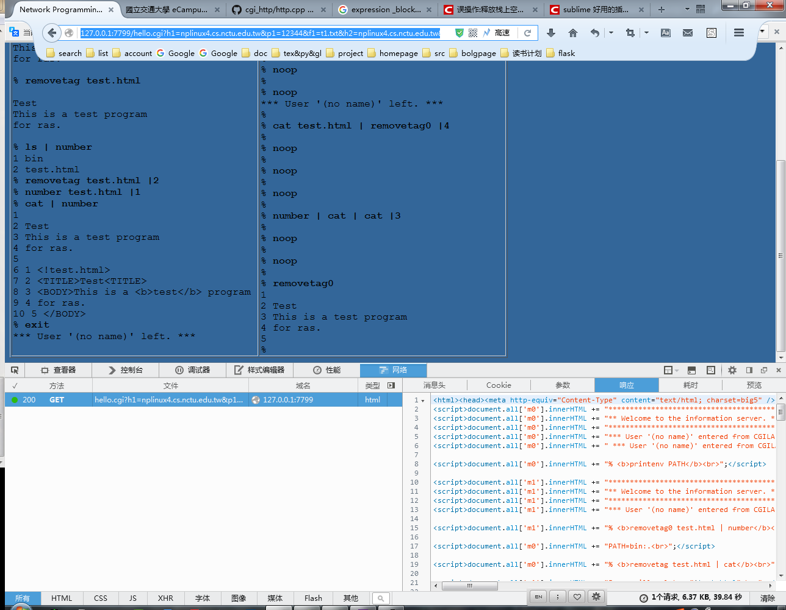

# Winsock pratice

## 目标

使用 winsock 实现 `HTTP Server`。

## 描述

绑定端口接受 browser 请求，开启新的 sock 网络连接 `ras(remote assess shell)` 服务器。

这个对话框程序既是 Server 也是 Client。

对于 Web browser 来说是 Server，对 `ras` 来说是 Client。

故 `winsock` 需要完成下面几个任务：

1. 解析 HTTP 请求（主要是 requestline，接受 GET method）
2. WSAAsyncSelect 网络连接到多个 `ras`
3. 对每个 `ras` open 对应 batfile （批处理输入文件），文件名由 GET method 中的参数指定。文件再工程根目录下，命名格式为：`t1.txt` ~ `t5.txt`。
4. 从 `ras` 服务器接受输出数据，并与输入文件中的指令（batfile)一起打包成 html 格式。
5. 加上 http 请求响应格式后，输出回 browser。

nonblocking 是通过 WASAsyncSelect 来完成。

## 测试

* 在远程服务器上提前开启 `ras` 服务等待接受连接，如下：

* 浏览器输入 `127.0.0.1:port`，窗口出现如下效果， prot define 在文件头部。 

* 完整测试为在浏览器输入：`http://127.0.0.1:7799/hello.cgi?h1=nplinux4.cs.nctu.edu.tw&p1=12344&f1=t1.txt&h2=nplinux4.cs.nctu.edu.tw&p2=12344&f2=t3.txt`

其中 `h1=nplinux4.cs.nctu.edu.tw` `h2=nplinux4.cs.nctu.edu.tw` 为 `ras` 所在 IP 地址，`p1` `p2` 分别为对应的端口号，`f1` `f2` 则为批处理输入文件。

效果如下：

